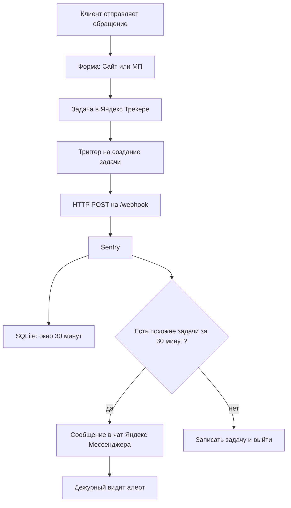
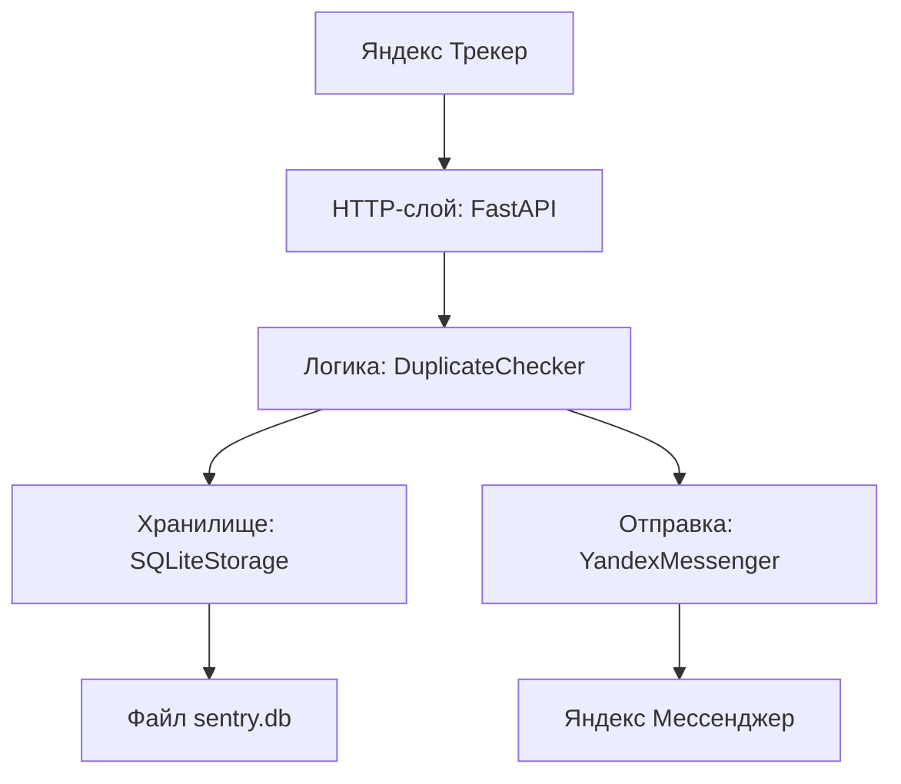
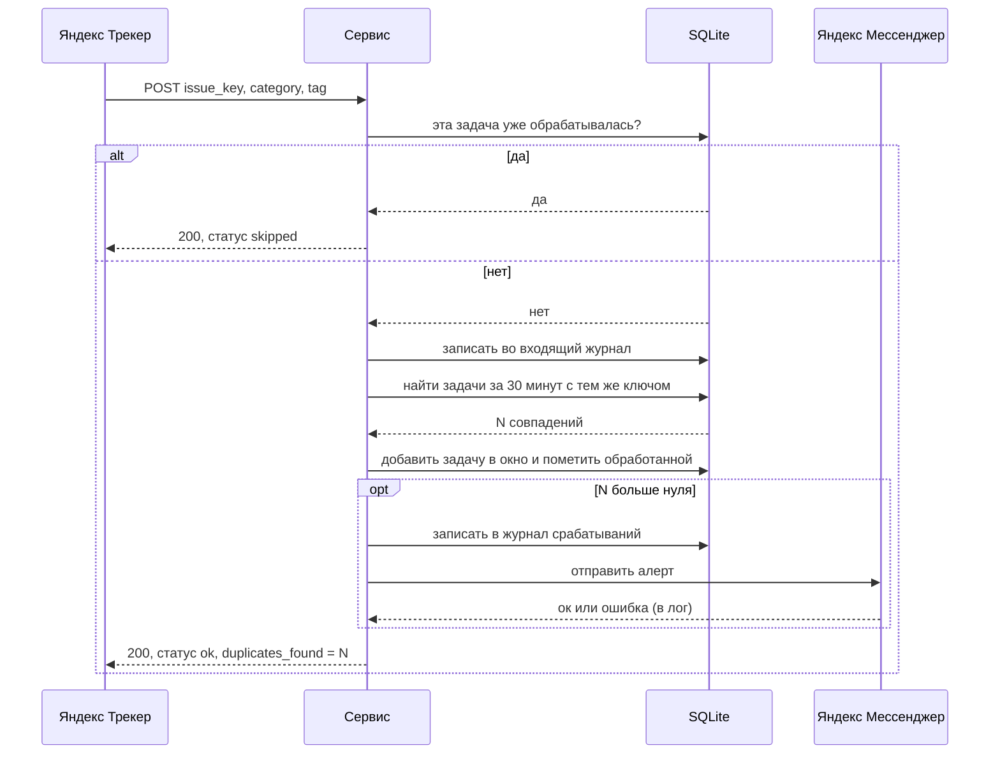

# Sentry — системный анализ

> **О названии.** Сервис внутренний, имя `Sentry` («часовой») не связано с продуктом
> sentry.io. В Docker локальный тег образа — `sentry-fl`, чтобы не путать с публичным.

| Поле | Значение |
| --- | --- |
| Назначение | Раннее обнаружение всплеска однотипных обращений клиентов и оповещение дежурных |
| Статус | MVP, готовится к запуску |
| Владелец | _заполнить_ |
| Репозиторий | _заполнить_ |
| Обновлено | 2026-08-31 |

Документ состоит из двух частей. **Часть I** — для бизнеса и продуктовых стейкхолдеров: зачем сервис нужен, какую проблему решает, почему его нельзя заменить настройками Яндекс Трекера. **Часть II** — для инженеров: архитектура, алгоритм, данные, API, эксплуатация.

---

# Часть I. Бизнес-контекст

## 1. Кратко

Клиенты жалуются на проблемы через две формы — «Сайт» и «МП». Каждая жалоба заводится задачей в Яндекс Трекере с указанием категории проблемы. Когда на проде что-то ломается, за несколько минут приходит пачка задач одной категории по одному каналу — это ранний признак инцидента.

**Sentry** непрерывно смотрит на поток новых задач и, как только видит вторую похожую задачу за короткое окно (по умолчанию 30 минут), отправляет сообщение в чат дежурных в Яндекс Мессенджере: какая категория, какой канал, ссылки на задачи, сколько их уже. Дежурный узнаёт об инциденте за 1–2 минуты, а не тогда, когда очередь вырастет до десятков обращений.

## 2. Проблема

### 2.1. Как устроен поток обращений

1. Клиент сталкивается с проблемой и заполняет форму обратной связи. Форм две: одна для веб-сайта, вторая для мобильного приложения.
2. Обращение автоматически превращается в задачу в Яндекс Трекере.
3. У задачи проставляется **категория** — тип проблемы: «оплата», «каталог не грузится», «ошибка входа» и т. п.
4. Наборы категорий у двух форм во многом совпадают: проблема с оплатой возможна и на сайте, и в приложении.

### 2.2. Что происходит при инциденте сегодня

Когда ломается общий компонент (платёжный шлюз, каталог, авторизация), обращения по этой теме идут волной. Но замечают эту волну поздно:

- поддержка разбирает задачи по очереди и не сразу видит, что десять последних — про одно и то же;
- нет автоматического сигнала «поток обращений категории X резко вырос»;
- вечером, ночью и в выходные реакция ещё медленнее;
- к моменту, когда инцидент заводят официально, счёт пострадавших клиентов идёт на сотни.

Итог: **время до обнаружения инцидента измеряется десятками минут**, и всё это время проблема не эскалирована.

### 2.3. Что меняет сервис

- **Время до обнаружения — минуты.** Сигнал приходит на второй похожей задаче.
- **Готовый контекст.** В сообщении сразу ссылки на задачи, счётчик, время первой жалобы — дежурному не нужно вручную искать в очереди.
- **Разделение по каналам.** Всплеск на сайте и всплеск в приложении — это два разных сообщения и, как правило, два разных инцидента.
- **Круглосуточно и единообразно.** Автоматика не зависит от того, кто сегодня разбирает очередь.

### 2.4. Границы: что сервис делает и чего не делает

**Делает:**

- считает частоту появления задач с одинаковой парой «категория + канал» в скользящем окне;
- при превышении порога шлёт текстовый алерт в один чат Яндекс Мессенджера;
- ведёт короткий журнал входящих событий и сработавших алертов для разбора.

**Не делает:**

- не заводит и не редактирует задачи в Трекере;
- не классифицирует проблему и не определяет первопричину;
- не эскалирует, не создаёт инцидент, не будит по телефону — только сообщение в чат;
- не хранит историю самих задач (статусы, решение, исполнителя) — это данные Трекера. Свою историю событий сервис ведёт и показывает на дашборде (раздел 10.3), но это про поток и всплески, а не про жизненный цикл задач;
- не является системой мониторинга инфраструктуры (не смотрит на метрики сервисов, только на поток обращений).

## 3. Пример: как это выглядит в жизни

Условный сценарий сбоя оплаты на сайте.

1. **10:02** — клиент жалуется, что не проходит оплата картой. Заводится задача `SHOP-1041`, категория «Оплата», канал «Сайт». Сервис видит первую задачу — это ещё не сигнал, просто запоминает её на 30 минут.
2. **10:05** — вторая жалоба на оплату с сайта, задача `SHOP-1042`. Сервис находит в окне предыдущую задачу той же пары «Оплата + Сайт» и **отправляет сообщение в чат дежурных**: категория «Оплата», канал «Сайт», новая задача `SHOP-1042`, совпадений за 30 минут — 1, первая задача `SHOP-1041` от 10:02, обе со ссылками.
3. **10:06–10:20** — приходят ещё жалобы. На каждую новую задачу сервис шлёт обновление с растущим счётчиком (2, 3, 5, 9…). Чат «пульсирует», пока идёт поток.
4. **10:07** — дежурный, увидев первое сообщение, открывает задачи по ссылкам, подтверждает сбой платёжного шлюза и заводит инцидент. Между началом волны и реакцией прошло ~5 минут вместо получаса.
5. **10:40** — поток прекратился. Новых совпадений в окне нет, сервис молчит. Записи о волне остаются в журнале сработавших алертов.

## 4. Почему это нельзя сделать в самом Яндекс Трекере

Вопрос закономерный: в Трекере есть автоматизация (триггеры, автодействия, правила SLA). Разберём, почему её недостаточно.

### 4.1. Что умеет автоматизация Трекера

- **Триггер** срабатывает на событие с **одной** задачей: создание, смена статуса, комментарий, изменение поля.
- **Условия триггера** — это фильтр по свойствам этой самой задачи (и её связей). Нельзя написать условие вида «в очереди уже есть N задач с таким же полем».
- **Действия**: изменить поля, добавить комментарий, создать связанную задачу, отправить письмо, **вызвать внешний HTTP-запрос**.
- **Состояния между срабатываниями нет.** Триггер не помнит, что было на прошлой задаче: нет переменных, счётчиков, таймеров.
- **Планировщика произвольной логики нет.** Есть правила SLA — но они про сроки одной задачи, а не про поток.

### 4.2. Что нужно для нашей задачи

1. **Агрегация по множеству задач.** «Сколько задач с парой (категория + канал) появилось за последние 30 минут» — это запрос по многим задачам, а триггер живёт в контексте одной.
2. **Состояние и скользящее окно.** Нужно где-то хранить недавние задачи и удалять их по истечении 30 минут.
3. **Составной вычисляемый ключ** «категория + канал» с разным поведением, когда канал не указан.
4. **Защита от повторной обработки** одной и той же задачи, если триггер сработает дважды.
5. **Одно осмысленное сообщение** с агрегированным контекстом (счётчик, первая задача, ссылки) во внешний мессенджер AV — не «создана задача», а «вот всплеск».

Пунктов 1–3 в модели триггеров нет в принципе. Пункт 5 возможен лишь частично: HTTP-вызов есть, но тело формируется по одной задаче.

### 4.3. Разбор конкретных обходных путей

- **Триггер с условием «если похожих задач больше N».** Нельзя: фильтр триггера видит только текущую задачу, а не очередь.
- **Действие по расписанию, которое раз в несколько минут считает и шлёт.** Нельзя: в Трекере нет планировщика для произвольного кода, только SLA и триггеры-на-событие.
- **Дашборд или виджет «динамика по категориям».** Это визуализация, а не оповещение: нужен человек, который постоянно смотрит на экран.
- **Подписка на очередь / штатные уведомления Трекера.** Приходят на каждую задачу по отдельности, без агрегации и без «это уже пятая за десять минут», и не в чат дежурных AV.
- **Автосвязывание задач.** Нечем автоматически определить, что задачи относятся к одной волне: критерий «одинаковая категория и канал за окно» надо где-то вычислять и хранить.

### 4.4. Вывод

Задача относится к классу **потоковой обработки событий с состоянием и скользящим окном** плюс доставка агрегированного оповещения во внешний канал. Трекер умеет «на событие по одной задаче выполнить действие». Разрыв закрывается небольшим внешним сервисом, который Трекер дёргает на каждой новой задаче через HTTP-вызов.

## 5. Текущий статус и что осталось

- Логика детектирования, хранение и журналирование — готово, покрыто ручной проверкой.
- Переход с прежнего канала (Telegram) на Яндекс Мессенджер — сделано в коде.
- **Не проверено вживую:** отправка в Яндекс Мессенджер. Хост `ymnb.av.ru` доступен только из внутренней сети AV — тест нужно провести на целевой площадке с боевым токеном.
- **Требуется до запуска:** развернуть на площадке во внутренней сети, настроить два триггера в Трекере, задать `WEBHOOK_TOKEN`, назначить владельца и дежурный чат.

---

# Часть II. Техническое описание

## 6. Общая картина

Один процесс на Python (FastAPI + uvicorn), упакованный в Docker-контейнер. Принимает HTTP-вебхуки от Яндекс Трекера, хранит состояние в локальном файле SQLite, при обнаружении всплеска шлёт сообщение в Яндекс Мессенджер.



Нагрузочный профиль: примерно до 50 задач в сутки, пики во время инцидентов. Отсюда все решения по простоте: один процесс, один файл БД, никаких внешних хранилищ.

## 7. Архитектура

### 7.1. Компоненты



Всё, кроме файла базы, самого Трекера и мессенджера, — это один процесс в одном контейнере (`app.py` плюс модуль `yandex_messenger.py`). Роли компонентов:

- **HTTP-слой (`app.py`, FastAPI).** Маршрутизация, валидация тела запроса через pydantic, проверка заголовка `X-Webhook-Token`, формирование ответа.
- **`DuplicateChecker`.** Оркестрация обработки одной задачи: проверка на повтор, запись в журнал, поиск совпадений, запись в окно, отправка алерта. Держит асинхронный замок для критической секции.
- **`SQLiteStorage`.** Единственная точка доступа к базе. Инкапсулирует все четыре таблицы, очистку по TTL и обрезку журналов.
- **`YandexMessenger` (`yandex_messenger.py`).** Формирует текст сообщения и делает HTTP-запрос в API мессенджера. Мягко обрабатывает ошибки — сбой отправки не роняет обработку вебхука.
- **`db_inspect.py`.** Отдельная утилита: печатает содержимое таблиц. В рантайме не участвует, нужна для разбора ситуаций.
- **`dashboard.html`.** Самодостаточная страница дашборда, отдаётся маршрутом `GET /dashboard` (раздел 10.3). Внешних ресурсов не тянет.

### 7.2. Обработка вебхука по шагам



### 7.3. Модель конкурентности

- **Один воркер uvicorn.** Задано и в `Dockerfile`, и в `docker-compose.yml`. Несколько воркеров сломали бы дедупликацию, потому что состояние лежит в локальном файле.
- **Асинхронный замок в бизнес-логике.** Блок «проверка на повтор → запись в журнал → поиск совпадений → запись в окно → пометка обработанной» выполняется под `asyncio.Lock`. Два одновременных вебхука не могут «разъехаться» между проверкой и записью.
- **Замок на уровне хранилища.** Внутри `SQLiteStorage` одно соединение с флагом `check_same_thread=False`, все операции обёрнуты в `threading.Lock`. Режим журналирования базы — WAL.
- **Отправка в мессенджер — вне замка.** Сетевой запрос не держит критическую секцию, параллельные вебхуки не блокируются на время доставки.

Гонок при таком устройстве нет. Цена — последовательная обработка запросов, что при нагрузке до 50 задач в сутки несущественно.

## 8. Алгоритм детектирования

### 8.1. Ключ дедупликации

Ключ, по которому две задачи считаются «похожими», — это пара **категория + тег**, где тег обозначает канал (`Сайт` или `МП`).

Почему нужен тег. Формы «Сайт» и «МП» имеют пересекающиеся категории. Если ключом была бы только категория, то жалоба на оплату с сайта и жалоба на оплату в приложении склеивались бы в один всплеск, хотя это могут быть независимые проблемы. Тег разделяет каналы.

Тег не приходит из данных задачи — он **захардкожен в каждом триггере**: один триггер для формы «Сайт» всегда шлёт `"tag": "Сайт"`, второй — `"tag": "МП"`.

### 8.2. Правила сравнения

- **Тег задан** (`Сайт` или `МП`) — новая задача сравнивается только с задачами окна, у которых тот же тег.
- **Тег пустой** — новая задача сравнивается со всеми задачами окна этой категории, независимо от тега. Это резервная ветка на случай ручного вызова или неполного тела; при штатной работе теги всегда проставлены.
- **Категория пустая** — подставляется значение `Без категории`, дальше обрабатывается как обычная категория.

Асимметрия резервной ветки: задача без тега найдёт тегированные задачи в окне, но тегированная задача не найдёт задачу без тега (условие по тегу не совпадёт с пустым значением). При штатных триггерах это не проявляется.

### 8.3. Псевдокод обработки одной задачи

```
принять payload (issue_key, summary, category, tag, ...)
category := trim(category) или "Без категории"
tag := trim(tag)

# критическая секция под asyncio-замком
если задача issue_key уже помечена обработанной:
    вернуть {status: skipped, reason: already_processed}

записать входящее событие в incoming_log

# очистка протухшего и поиск
удалить из seen записи с истёкшим сроком
удалить из tasks записи старше окна
matches := задачи из tasks за последнее окно с тем же ключом (category [+ tag])

добавить текущую задачу в tasks (со временем "сейчас")
пометить issue_key обработанной на срок = окно
# конец критической секции

если matches не пустой:
    first := самая ранняя задача из matches
    записать запись в duplicate_log
    отправить алерт в мессенджер (category, tag, новая задача, len(matches), first, ссылки)

вернуть {status: ok, duplicates_found: len(matches), duplicate_detected: matches не пустой}
```

### 8.4. Скользящее окно и TTL

- Размер окна — `WINDOW_MINUTES` (по умолчанию 30).
- Время задачи в окне — это **момент приёма вебхука сервисом**, а не поле `created_at` из тела. Поле `created_at` в расчётах не используется.
- Чистка происходит лениво: при каждом поиске совпадений сначала удаляются записи `seen` с истёкшим сроком и записи `tasks` старше окна. Отдельного фонового процесса очистки нет.

### 8.5. Идемпотентность

Триггер Трекера может сработать по одной задаче дважды (повтор доставки, ретрай). Чтобы такая задача не «нашла сама себя» и не задвоила счётчик, при обработке ключ `issue_key` заносится в таблицу `seen` на срок, равный окну. Повторный вебхук по тому же ключу в пределах окна получает ответ `skipped` и дальше не обрабатывается.

### 8.6. Порог и повторные срабатывания

- **Порог — одно совпадение.** Вторая задача с тем же ключом за окно уже даёт алерт. Настройки «минимум N» нет.
- **Алерты не схлопываются.** Если за окно пришло 5 задач, сообщения уйдут на 2-ю, 3-ю, 4-ю и 5-ю — каждое со своим (растущим) счётчиком. Во время активного инцидента это осознанное поведение: канал продолжает подавать сигнал, пока идёт поток. При желании это можно поменять — см. раздел «Дорожная карта».

## 9. Модель данных

Одна база SQLite, путь задаётся `DB_PATH`. Локально — `data/sentry.db`, в контейнере — `/app/data/sentry.db` на именованном томе. Схема создаётся при старте (`CREATE TABLE IF NOT EXISTS`), миграций нет.

Все временные метки хранятся как Unix-время (секунды, UTC).

### 9.1. Таблица `seen` — защита от повторной обработки

- `issue_key` (TEXT, первичный ключ) — ключ задачи Трекера.
- `expires_at` (REAL) — момент, после которого запись считается протухшей. Равен времени обработки плюс окно.

### 9.2. Таблица `tasks` — скользящее окно

- `id` (INTEGER, автоинкремент).
- `issue_key` (TEXT) — ключ задачи.
- `category` (TEXT) — нормализованная категория.
- `tag` (TEXT или NULL) — канал: `Сайт`, `МП` или NULL.
- `created_at` (REAL) — время приёма вебхука.

Индекс по паре `(category, created_at)` — под запрос поиска совпадений.

### 9.3. Таблица `incoming_log` — журнал всех входящих

- `id` (INTEGER, автоинкремент).
- `data` (TEXT) — JSON события: `issue_key`, `summary`, `category`, `tag`, `received_at`.
- `created_at` (REAL).

### 9.4. Таблица `duplicate_log` — журнал сработавших алертов

- `id` (INTEGER, автоинкремент).
- `data` (TEXT) — JSON алерта: новая задача, категория, тег, счётчик, первая задача окна, ссылки, время обнаружения.
- `created_at` (REAL).

### 9.5. Таблица `events` — журнал аналитики (для дашборда)

Append-only: одна строка на каждую **обработанную** задачу (повторы со статусом `skipped` не пишутся). Отдельные колонки вместо JSON-блоба — под агрегирующие запросы.

- `id` (INTEGER, автоинкремент).
- `ts` (REAL) — время приёма вебхука.
- `issue_key` (TEXT) — ключ задачи.
- `category` (TEXT) — нормализованная категория.
- `tag` (TEXT или NULL) — канал.
- `is_duplicate` (INTEGER 0/1) — задача пришла, когда всплеск уже шёл.
- `duplicate_count` (INTEGER) — сколько совпадений было в окне на этот момент (0, если не всплеск).
- `first_issue_key` (TEXT или NULL) — ключ первой задачи всплеска; по нему группируются инциденты.

Индексы: `(ts)` и `(category, ts)`.

### 9.6. Жизненный цикл записей

- `seen` и `tasks` живут не дольше окна и чистятся лениво при поиске совпадений.
- `incoming_log` и `duplicate_log` чистятся не по времени, а по количеству: при каждой вставке лишние старые строки удаляются так, чтобы осталось не больше `MAX_LOG_ENTRIES` (по умолчанию 200) записей в каждой таблице. Это отладочный буфер, не история.
- `events` — по времени: строки старше `EVENTS_RETENTION_DAYS` (по умолчанию 365) удаляются лениво при том же `_purge()`. `0` — не чистить. Это и есть источник для дашборда и внешнего BI.
- Полный сброс — эндпоинт `POST /api/v1/clear` (чистит и `events` тоже) или удаление тома (`docker compose down -v`).

### 9.7. Почему SQLite, а не Redis или PostgreSQL

- Нагрузка до 50 задач в сутки, один процесс — серверная СУБД избыточна.
- `sqlite3` входит в стандартную библиотеку Python: ни отдельного сервиса, ни дополнительного пакета.
- Файл на томе переживает пересборку и перезапуск контейнера — состояние не теряется.
- Прежняя версия хранила состояние в оперативной памяти и дополнительно использовала Redis; его убрали как избыточный. Переход на SQLite добавил устойчивость к перезапуску без новой инфраструктуры.
- Объём аналитики тоже небольшой: 50 задач/сут ≈ 18 тыс. строк в `events` за год. Агрегирующие запросы для дашборда выполняются за миллисекунды.

Плата за простоту: файл локальный, поэтому масштабирование в несколько процессов или реплик невозможно. Для текущей нагрузки это приемлемо. Если какая-то очередь начнёт давать тысячи задач в сутки — `events` стоит вынести в отдельное хранилище (Postgres/ClickHouse) или во внешний BI-приёмник.

## 10. HTTP API

Базовый адрес — `http://<host>:8000`. Автодокументация — `/docs`.

- `POST /webhook` — приём события от триггера Трекера. Защищён.
- `GET /health` — проверка живости, используется в healthcheck контейнера. Открыт.
- `GET /api/v1/stats` — счётчики (журналы, `events_total`, размер окна, retention). Открыт.
- `GET /api/v1/log?limit=50` — последние записи обоих журналов. Защищён.
- `POST /api/v1/clear` — полная очистка базы, возвращает число удалённых строк. Защищён.
- `POST /api/v1/test-notify` — отправить тестовое сообщение в мессенджер. Защищён.
- `GET /dashboard` — HTML-страница дашборда. Открыт.
- `GET /api/v1/analytics/overview?days=N` — агрегаты для дашборда одним ответом. Открыт.
- `GET /api/v1/analytics/events?days=N&limit=&offset=` — сырые строки `events`. Защищён.
- `GET /` — краткая справка о сервисе. Открыт.

### 10.1. Аутентификация

Если переменная `WEBHOOK_TOKEN` задана, каждый защищённый запрос обязан прислать заголовок `X-Webhook-Token` с этим же значением, иначе ответ `401`. Если переменная пустая, защита отключена и при старте в лог пишется предупреждение. Для боевой среды переменную нужно задать.

### 10.2. Контракт `POST /webhook`

Тело запроса (JSON):

- `issue_key` (строка, обязательно) — ключ задачи.
- `summary` (строка, необязательно) — заголовок задачи, попадает только в журнал.
- `category` (строка, необязательно) — категория; пустая заменяется на `Без категории`.
- `tag` (строка, необязательно) — канал; пустой включает сравнение по категории без учёта канала.
- `created_at` (дата-время, необязательно) — если не передано, подставляется текущее время; в расчёте окна не используется.
- `url` (строка, необязательно) — не используется; ссылки строятся из `TRACKER_URL` и `issue_key`.

Ответ: `200` с телом `{"status": "success", "data": {...}}`, где `data.status` — `ok` или `skipped`, и при `ok` присутствует `duplicates_found` (число совпадений за окно).

Ошибки: `400` — пустой `issue_key`; `401` — неверный или отсутствующий `X-Webhook-Token` (если защита включена).

### 10.3. Дашборд и аналитика

`GET /dashboard` отдаёт **самодостаточную HTML-страницу**: графики рисуются инлайн (свой мини-рендер SVG), внешних ресурсов и CDN нет — работает в изолированной внутренней сети. Страница делает один запрос к `GET /api/v1/analytics/overview?days=N` и рисует:

- KPI-сводку: всего задач, задач в сутки, число инцидентов, задач во всплесках, доля во всплесках, средний размер всплеска;
- поток задач по времени (bucket — час при `days ≤ 2`, иначе день), с выделением задач, пришедших во время всплеска;
- топ-15 категорий и разбивку по каналам (обе — с долей «во всплеске»);
- число инцидентов по времени;
- тепловую карту «час × день недели» по времени прихода задач;
- таблицу последних всплесков (первая задача со ссылкой в Трекер, категория, канал, размер).

Диапазон — `7 / 30 / 90 / 365` дней, есть автообновление раз в 30 секунд.

**Источник данных** — таблица `events` (раздел 9.5). Расчёт инцидента: строки с `is_duplicate = 1` группируются по `first_issue_key`; размер = число таких строк + 1 (первая задача). Времена в агрегатах приводятся к МСК (`TIMEZONE_OFFSET`).

**Для внешнего BI:** `GET /api/v1/analytics/overview?days=N` (те же агрегаты в JSON) или `GET /api/v1/analytics/events` (сырые строки, под токеном, с пагинацией `limit`/`offset`).

**Доступ:** `/dashboard` и `/overview` открыты (как `/api/v1/stats`); если хост доступен извне периметра — закрыть на сетевом уровне. Раздел 9.5 объясняет, почему аналитику вынесли в отдельную таблицу, а не считают по `incoming_log`.

## 11. Интеграция с Яндекс Трекером

### 11.1. Триггеры

Нужны **два триггера** на создание задачи — по одному на каждую форму. Действие — «Вызвать HTTP»:

- метод: `POST`;
- URL: `http://<host>:8000/webhook`;
- заголовки: `Content-Type: application/json` и, если задан `WEBHOOK_TOKEN`, `X-Webhook-Token: <значение>`;
- тело: JSON с полями задачи.

### 11.2. Пример тела

```json
{
  "issue_key": "SHOP-1042",
  "summary": "Не проходит оплата картой",
  "category": "Оплата",
  "tag": "Сайт"
}
```

Во втором триггере `tag` равен `"МП"`. Значение `category` подставляется из переменной поля категории вашей очереди.

## 12. Интеграция с Яндекс Мессенджером

### 12.1. Запрос

```
POST {YANDEX_MESSENGER_URL}
Content-Type: application/json
Authorization: Bearer {YANDEX_MESSENGER_TOKEN}

{ "chat_id": "{YANDEX_MESSENGER_CHAT_ID}", "text": "<текст сообщения>" }
```

Значение `YANDEX_MESSENGER_URL` по умолчанию — `https://ymnb.av.ru/api/messages/send`. Идентификатор чата имеет формат `0/0/<uuid>`.

### 12.2. Формат сообщения

Мессенджер принимает **только простой текст**, без HTML и Markdown. Ссылки на задачи выводятся отдельной строкой. Сообщение об инциденте содержит: категорию, тег, ключ и ссылку новой задачи, число совпадений за окно, ключ, ссылку и время первой задачи окна, время обнаружения.

Пример:

```
⚠️ ОБНАРУЖЕНО ПОВТОРЕНИЕ КАТЕГОРИИ

📌 Категория: Оплата
🏷 Тег: Сайт

🆕 Новая задача: SHOP-1042
https://tracker.yandex.ru/SHOP-1042
🔁 Совпадений за 30 мин: 1

📅 Первая задача: SHOP-1041
https://tracker.yandex.ru/SHOP-1041
🕒 Создана: 31.08.2026 10:02:14

⏰ Обнаружено: 31.08.2026 10:05:39
💡 Рекомендуется проверить задачи на массовость
```

### 12.3. Обработка ошибок

- Коды `401` и `403` — в лог пишется подсказка про токен, метод возвращает «не отправлено».
- Прочие ошибки HTTP, таймаут, сетевые сбои — в лог, возврат «не отправлено».
- **Сбой отправки не влияет на ответ Трекеру** — вебхук всегда завершается `200`, факт всплеска остаётся в `duplicate_log`.
- Повторных попыток нет — одна отправка на событие.

### 12.4. Сетевое ограничение

Хост `ymnb.av.ru` отвечает только на запросы из внутренней сети AV; извне периметра отдаётся `470` (блокировка). Следствие: сервис нужно разворачивать там, где одновременно доступны и вебхуки Трекера, и `ymnb.av.ru`.

### 12.5. История канала

Ранее алерты уходили в Telegram (модуль `telegram_bot.py`). Модуль удалён и заменён на `yandex_messenger.py` с тем же набором методов. Эндпоинт проверки переименован с `/api/v1/test-telegram` на `/api/v1/test-notify`.

## 13. Переменные окружения

Задаются через файл `.env` (шаблон — `.env.example`).

**Яндекс Мессенджер**

- `YANDEX_MESSENGER_URL` — адрес API отправки. По умолчанию `https://ymnb.av.ru/api/messages/send`.
- `YANDEX_MESSENGER_TOKEN` — OAuth-токен, уходит в заголовке `Authorization: Bearer`. Обязателен.
- `YANDEX_MESSENGER_CHAT_ID` — идентификатор чата, формат `0/0/<uuid>`. Обязателен.

**Приём вебхука**

- `WEBHOOK_TOKEN` — если задан, защищённые эндпоинты требуют заголовок `X-Webhook-Token`. Если пусто — приём открыт. Рекомендуется задать.
- `TRACKER_URL` — база для ссылок на задачи. По умолчанию `https://tracker.yandex.ru`.

**Поведение детектора**

- `WINDOW_MINUTES` — ширина окна в минутах. По умолчанию `30`.
- `MAX_LOG_ENTRIES` — сколько последних записей хранить в каждом журнале. По умолчанию `200`.
- `TIMEZONE_OFFSET` — сдвиг часов для времени в сообщениях. По умолчанию `3`.

**Инфраструктура**

- `DB_PATH` — путь к файлу SQLite. В Docker переопределён на `/app/data/sentry.db`.
- `EVENTS_RETENTION_DAYS` — сколько дней хранить строки `events` для дашборда. По умолчанию `365`; `0` — не чистить.
- `PORT` — порт на хосте. По умолчанию `8000`.

## 14. Развёртывание

### 14.1. Требования

Docker с плагином compose. Больше ничего — Python и зависимости внутри образа.

### 14.2. Первый запуск

```bash
cp .env.example .env
# заполнить YANDEX_MESSENGER_TOKEN, YANDEX_MESSENGER_CHAT_ID, WEBHOOK_TOKEN
docker compose up -d --build
curl http://localhost:8000/health
```

Короткие команды в `Makefile`: `make up`, `make down`, `make logs`, `make rebuild`, `make token` (генерация значения для `WEBHOOK_TOKEN`).

Устройство контейнера: образ на `python:3.12-slim` (локальный тег `sentry-fl`), процесс от непривилегированного пользователя, один воркер uvicorn, healthcheck на `/health`, автоперезапуск `unless-stopped`, ротация логов (3 файла по 10 МБ), том `sentry-data` смонтирован в `/app/data`.

### 14.3. Обновление

```bash
git pull
docker compose up -d --build
```

Том с базой сохраняется, окно и журналы не теряются.

## 15. Эксплуатация

### 15.1. Проверка живости

```bash
curl http://<host>:8000/health
# {"status":"healthy","storage":"sqlite","timestamp":"..."}
```

### 15.2. Просмотр состояния базы

- В контейнере: `docker compose exec sentry python db_inspect.py` — печатает счётчики и последние записи всех таблиц, включая рабочее окно `tasks`, `seen` и `events`.
- Через API: `GET /api/v1/log` (журналы), `GET /api/v1/stats` (счётчики), `GET /dashboard` (аналитика).

Первое нужно для разбора «почему не пришёл / почему пришёл лишний алерт»: только там видно фактическое содержимое окна.

### 15.3. Резервное копирование

```bash
docker compose cp sentry:/app/data/sentry.db ./backup.db
```

При потере теряются окно последних 30 минут, короткие журналы и история `events` (аналитика за `EVENTS_RETENTION_DAYS`). Если дашбордами пользуются — файл БД стоит бэкапить регулярно.

### 15.4. Сброс состояния

- Мягко: `POST /api/v1/clear` (с заголовком `X-Webhook-Token`, если включён).
- Жёстко: `docker compose down -v` — удаляет том вместе с файлом БД.

### 15.5. Типовые ситуации и что делать

- **Алерты не приходят вовсе.** Проверить `GET /api/v1/stats` — растёт ли `events_total`. Если не растёт — вебхуки не доходят (триггер, сеть, токен). Если растёт, а сообщений нет — проблема на стороне мессенджера: посмотреть логи на `401/403/470`, проверить токен и доступность `ymnb.av.ru` с хоста, дёрнуть `POST /api/v1/test-notify`.
- **Алертов слишком много.** Ожидаемое поведение при активном инциденте (сообщение на каждую задачу). Если мешает — временно приглушить чат; долгое решение — см. дорожную карту (порог и схлопывание).
- **После перезапуска сомнения в состоянии.** `db_inspect.py` покажет, что в окне; при необходимости `POST /api/v1/clear`.
- **Контейнер в рестарт-петле.** Смотреть `docker compose logs`. Вероятные причины: недоступен путь тома, битый `.env`.

## 16. Наблюдаемость

- **Логи процесса** (stdout, собираются Docker, уровень INFO): каждое входящее событие, пропуск повтора, срабатывание с числом совпадений, результат отправки в мессенджер, предупреждение об открытых эндпоинтах при пустом `WEBHOOK_TOKEN`.
- **Дашборд** `/dashboard` и `GET /api/v1/stats` (`events_total`) — для наблюдения за потоком и всплесками во времени.
- Метрик в формате Prometheus нет — см. дорожную карту.

Замечание по времени: внутри всё считается в UTC. В тексте сообщений, в записях `duplicate_log` и в агрегатах дашборда время приведено к МСК (`TIMEZONE_OFFSET`); в `incoming_log.received_at` и в `events.ts` — UTC. При ручном чтении это стоит держать в голове.

## 17. Тестирование

Автоматических тестов в репозитории нет. Проверка перед запуском — ручная:

1. Поднять сервис локально с временной базой (`DB_PATH=:memory:` или отдельный файл).
2. Отправить два одинаковых вебхука (`category` и `tag` совпадают) — на втором должен вернуться `duplicate_detected: true` и уйти сообщение.
3. Отправить третий с тем же `issue_key`, что и первый, — должен вернуться `skipped`.
4. Проверить разделение каналов: одинаковая категория, но разные `tag` — совпадением считаться не должны.
5. `POST /api/v1/test-notify` — доставка в чат (только из внутренней сети AV).
6. Открыть `/dashboard` — на графиках должны появиться отправленные задачи; `GET /api/v1/analytics/overview` — те же цифры в JSON.

## 18. Дорожная карта

- **Порог и анти-флуд.** Настраиваемый минимум совпадений; одно сообщение на всплеск плюс редкие обновления «стало +K» вместо сообщения на каждую задачу.
- **Повторные попытки отправки** в мессенджер с нарастающей паузой.
- **Метрики** через `/metrics`: число входящих, число алертов, задержка обработки.
- **Окно по времени создания задачи** вместо времени приёма вебхука, если поле `created_at` приходит стабильно.
- **Мультиочередь.** Поле `queue` в payload, ключ дедупа `queue + категория + тег`, карта `queue → chat_id`, окно/порог на очередь. Правки локальны (payload, сборка ключа, выбор чата, `events` уже готова принять колонку `queue`).
- **Вынести `events`** в отдельное хранилище или BI-приёмник, если появится очередь с тысячами задач в сутки.
- **Автотесты** на алгоритм детектирования и на агрегаты аналитики.

Сделано в этой версии: append-only таблица `events`, страница `/dashboard`, API `GET /api/v1/analytics/*`.

## 19. Ограничения и технический долг

- **Единая точка отказа.** Один процесс, один контейнер. Пока сервис недоступен, всплески не детектируются. `restart: unless-stopped` сокращает простой, но не устраняет риск.
- **Не масштабируется.** Состояние в локальном файле под замком — несколько реплик невозможны by design.
- **Точность окна.** Отсчёт по времени приёма вебхука; при задержке доставки триггера возможны смещения.
- **Шум при инциденте.** Порог в одно совпадение и отсутствие схлопывания дают поток сообщений.
- **Отправка без ретраев.** Одна попытка; при сбое — только запись в журнал и лог.
- **Журналы `*_log` — не история.** Обрезаны до `MAX_LOG_ENTRIES`, это отладочный буфер. Для аналитики есть отдельная таблица `events` (raw), но общей истории задач (статусы, решение, исполнитель) сервис не хранит — это данные Трекера.
- **Дашборд без аутентификации.** `/dashboard` и `/overview` открыты; полагаемся на сетевой периметр.
- **Смешанные представления времени** (UTC в `events.ts` и `incoming_log`, МСК в сообщениях, `duplicate_log` и агрегатах дашборда).
- **Жёсткая привязка к периметру** из-за `ymnb.av.ru`.
- **Нет автотестов.**

## 20. Глоссарий

- **Категория** — тип проблемы в обращении клиента; поле задачи Трекера.
- **Тег / канал** — источник обращения: `Сайт` или `МП`. Проставляется триггером, не приходит из данных задачи.
- **Окно** — скользящий интервал (по умолчанию 30 минут), в котором ищутся совпадения.
- **Совпадение** — другая задача в окне с той же парой «категория + тег».
- **Всплеск** — два и более совпадения за окно; повод для алерта.
- **Идемпотентность** — свойство, при котором повторная обработка того же события не меняет результат; здесь обеспечивается таблицей `seen`.
- **Критическая секция** — участок кода «проверка и запись состояния», выполняемый строго последовательно под замком.
- **TTL** — срок жизни записи; для `seen` и `tasks` равен размеру окна.
- **WAL** — режим журналирования SQLite (write-ahead log), повышающий устойчивость записи.
- **Инцидент (на дашборде)** — группа задач одного всплеска: строки `events` с общим `first_issue_key`.
- **`events`** — append-only таблица истории событий, источник дашборда и внешнего BI.

## Приложение А. История изменений архитектуры

- **До 31.08.2026.** Состояние в оперативной памяти, дополнительно Redis и старый HTML-дашборд. Разделение каналов — по полю «область проблемы» (`requestArea`). Канал уведомлений — Telegram.
- **31.08.2026.** Redis и старый дашборд убраны как избыточные. Состояние переведено в SQLite. Разделение каналов — на явный тег из тела вебхука. Канал уведомлений — с Telegram на Яндекс Мессенджер. Добавлена утилита `db_inspect.py`.
- **31.08.2026 (позже).** Добавлена append-only таблица `events` с настраиваемым сроком хранения (`EVENTS_RETENTION_DAYS`), новый дашборд `/dashboard` (самодостаточная страница, без CDN) и API `GET /api/v1/analytics/*` для внешнего BI. Прежний дашборд не воскрешён — это новый компонент с чёткой ролью: поток обращений и всплески во времени.
- **31.08.2026 (переименование).** `Category Watcher` → `Sentry`. Изменились: заголовок FastAPI, `service`-ответ `/`, compose-сервис `sentry`, `container_name: sentry`, локальный тег образа `sentry-fl:latest`, том `sentry-data`, файл БД `sentry.db` (`DB_PATH`), заголовки дашборда, тексты в доках. Доменные термины (`tag`, `duplicate*`) пока не трогали.
